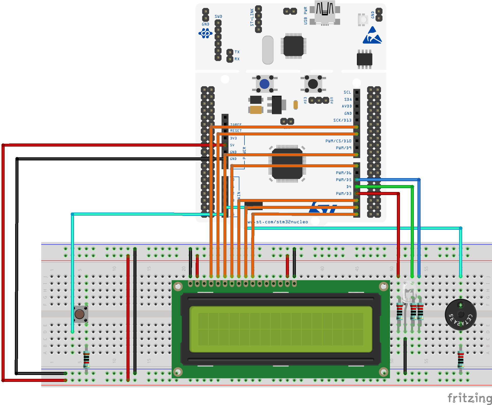

# Morse-Code-Teaching-Device
The Morse Code Teaching Device is the ultimate tool to learn Morse Code. Through constant testing and repetition, the MCTD teaches users the three core parts of morse code:
1. Reading "written" morse code
2. Listening to "auditory" morse code
3. "Writing" morse code using dits and dahs.

## How it Works
The MCTD works by asking a user a random question in morse code with a well-known answer (such as _Why did the chicken cross the road?_), either by using a buzzer, and LCD, or an LED. The user then uses the button to respond back in morse code with what they think the answer is (_To get to the other side._).

The user will know if they are correct if the LED turns green and the LCD displays a correct message after they finish inputting their answer.

The user will know if they are incorrect if the LED turns red and the LCD diplays an incorrect message after they finish inputting their answer.

## Subsystems
The MCTD is made up of three subsystems:
1. Output _(Reading and Listening)_
2. Input _(Writing)_
3. User Feedback _(Determining whether the user understood the prompt and responded properly)_

## Design

### The circuit is made up of the following components:
- 1 Button
- 3 220 Ω resistors
- 1 10k Ω resistor
- 1 16x2 LCD display
- 1 RGB LED
- 1 Active buzzer
- 1 STM32 Microcontroller Board

### All software is written in C with the PlatformIO framework and some prewritten helper functions.